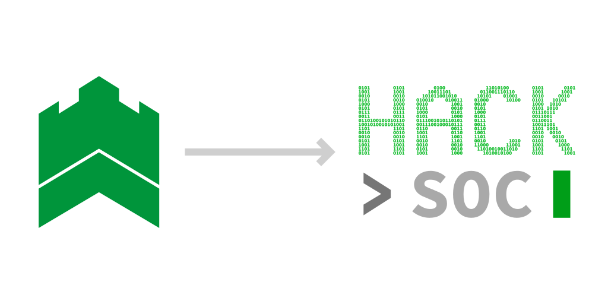
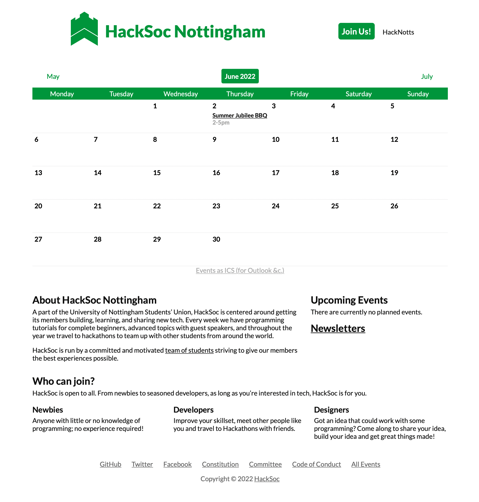
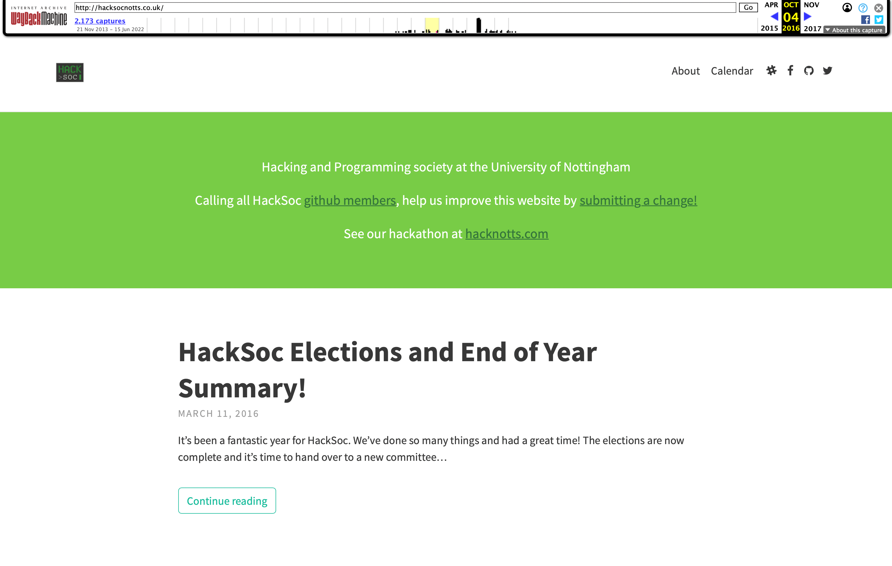
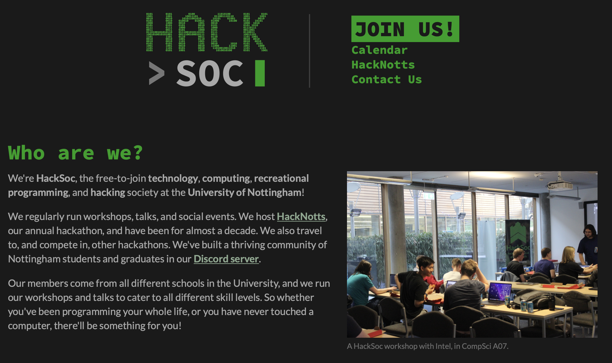

Welcome to our [new website](/)! This redesign coincides with our movement to a new branding for the society. If you've been a HackSoc member for a little while, you'll remember our previous logo (the green castle on the left, below.) If you've been a HackSoc member for even longer, you'll remember our *old* logo, which was very similar to the hacker-y logo (on the right.) You may also notice that the arrow is pointing from the *newer* one to the *older* one. This post aims to explain why.

## The Olden Days

The green castle logo was designed at some point in 2018. At this time, led by Aaron Osher, HackSoc was growing rapidly, becoming a more "professional" society. It almost ran like a company--all HackSoc property had printed asset tags, and we still have a living-roomful of boxes, crates, catering supplies, and filing cabinets from this time.

This is the HackSoc website before this one:

We had a lot of engagement from members, it was easy to find sponsors, and lots of great external speakers came in to give talks. But, in my opinion, and in the opinion of some other committee and members, this developed into something a bit more "opaque", "rigid", "corporate", and even "forbidding", to be slightly dramatic with my words. It is, after all, literally a castle...

## The Even Oldener Days

Before this, I wasn't around. Well, I joined the University in 2019, so I wasn't even around for the previous branding change. My understanding is that the society used to be smaller. Obviously, perhaps. I don't think this is a bad thing, however. Of course, member engagement is the priority, but currently we have upwards of four hundred members, less than fifteen of whom frequently attend events.

I think there is something friendly and accepting about the old branding. I've read the minutes of the meetings from around the transition time, and I can't work out why they ever switched to the green castle logo. Sure, it looks more professional, but this is a student-run society. Professionalism isn't something we aim for. Here's a screenshot of the website from 2016:

In fact, I think that professionalism, especially the kind that makes us appear as some kind of coprorate entity, is actually something we should actively try to avoid. Even if it makes us seem more "proper", like a "real" society, I think it scares people off.

A society should give its members the impression that they can go to an event, meet people, and have fun, but to me, the green castle logo says "this is a professional group of people. Come and learn some skills to put on your CV." I'm exaggerating slightly, but I don't think I'm the only person who gets this impression.

Of course, no offense meant to whomever designed the logo. My point is, the aims of the society have changed. Or if they haven't, I would like to change them. I'm also by *no means* saying that "this is a professional group of people. Come and learn some skills to put on your CV" was how people saw HackSoc; just, people had to be *convinced* and *shown* that this was not the case. A rebrand could give a different impression by default, which is my aim.

## Today

Recently, HackSoc's membership has been dwindling. This, I believe, is mostly down to COVID. We'll certainly attract hundreds of new members in September, but retaining them then becomes the problem.

I think that the key to this is more social events, and a more "friendly" branding, since both of these things should help us build more of a community. Also, we noticed that a lot of members have been afraid to come to our events, and I think a rebrand could help with this.

So, we're moving over to this new branding. This, being the beginning of the summer holidays, is the perfect time to do that, since we can have everything sorted out by the Freshers' Fair in September.

## Our New Brand

I will write up some real branding guidelines soon, which will appear on the website somewhere, but the crux of it is really these things:

 - Use of our new logo. It is more friendly, and less intimidating.
 - Use of Source Code Pro (a monospace font) for headers, and a black and green colour scheme. This hints at what we do as a society (namely: messing about with computers) and should make members feel more at home.
 - Things shouldn't be "too perfect" or "too professional." Websites and graphics should *feel* like they were made by a human. 
 - As much as possible, things should be open to our members, transparently. For example, we suggest on the [home page](/) that pull requests are very welcome for this website.

Specifics will come soon, but for now, I believe this will change the way that HackSoc is headed for the better. Also, hoodies in the new style will be coming soon, so stay tuned!

## Conclusion (TL;DR)

So, to conclude. Our new branding should give new members the impression that HackSoc is a friendly, open, welcoming place, rather than having to convince them of this *despite* a slightly imposing logo.

If you have any questions, or suggestions, or any issues with the new branding (even things like "I don't like that colour...",) please let us know! My DMs are always open on Discord.

If you've got this far, thanks for reading!